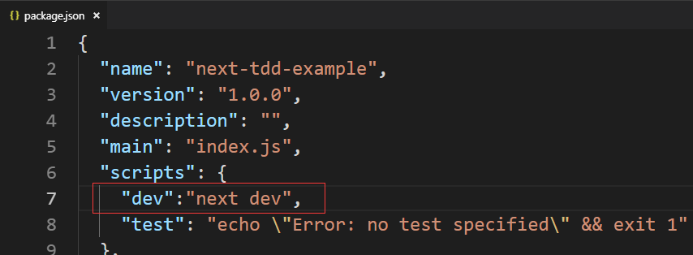

# next.js的TDD开发示例

需求假设：按不同的关键字通过github搜索api搜索并将结果展示在列表中

TDD步骤：

- 基础框架搭建（进行初步拆解，能够运行，不实现细节功能）
- 编写测试（编写测试后，测试时不会通过的）
- 逐个实现代码，直到测试可以跑通


## 基础框架搭建

拆解：

- pages/index.js 管理input控件并将其值传递给List
- components/List.js 查询github接口并渲染列表，每个项目使用Item来渲染
- components/Item.js 渲染单个列表项


初始化


安装 next react


package.json



pages/index.js


components/List.js


components/Item.js


现在运行一下


## 编写测试

添加jest-react环境，参考 https://github.com/zeit/next.js/tree/master/examples/with-jest-react-testing-library


package.json


.babelrc


jest.config.js


编写测试`__tests__/components/Item.test.js`


```
yarn test
```


失败是因为我们没有实现

## 编码实现

components/Item.js


```
yarn test
```


这样这个功能就算完成，一个基本的TDD流程就完成了，当然实际生产中测试要多一些，也复杂一些

## 快照测试

快照就是把组件渲染出来的html片段整个做对比，这样就可以简单粗暴的覆盖大部分细节测试了

快照测试需要把测试分成两个步骤：

- 生成快照，单纯生成或更新，用于初次完成组件或更新组件行为之后，决定使用这个版本的结果作为样本
- 对比快照，运行组件并拿结果和样本比对，如果不同则报错

> 快照测试这么好适用于所有情况么？不，存在随机行为的组件就不适合，比如随机密码生成器

增加一个快照测试 `__tests__/components/Item.test.js`


更新快照 `yarn test -u`


对应测试文件的目录下的`__snapshots__`目录下


测试快照 `yarn test`


为了演示快照测试的作用，假设某天手抖了改了代码不记得或者别人改了代码自己不知道


再运行快照测试就会失败了


发现快照失败，我就可以去看看这到底是不是我期望的更改，如果是，使用 `yarn test -u` 更新一下快照，如果不是，就把代码恢复到之前的版本

## mock 打桩/模拟

我们需要对组件依赖的一些运行环境进行模拟，来方便测试不同的情况，另一方面也避免了其他错误给测试带来干扰

在 jest 中打桩参考： https://jestjs.io/docs/en/mock-functions

假设我们的 `List` 组件要测试传入的列表为空和不为空两种不同的情况，但实际代码中使用的是 `axios` 来实现的，我们就要模拟 `axios` 的返回结果


安装 `axios`


编写测试 `__tests__/components/List.test.js`


运行测试


实现代码


测试通过，开发完成


...


注意虽然是通过了，但还是有错误信息输出，这是因为之前官方也没有考虑很多异步状态变化的问题尤其是加了 hook api 之后问题更明显了，这个要等react官方来修复了